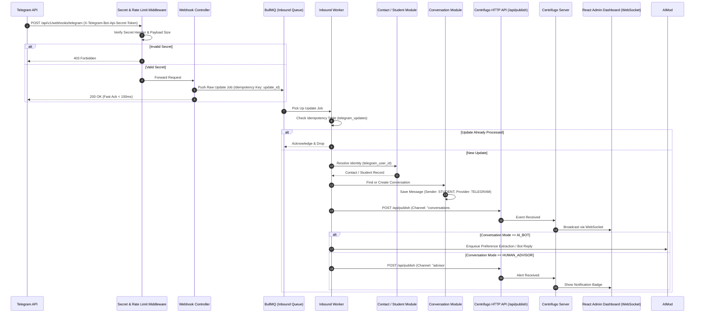
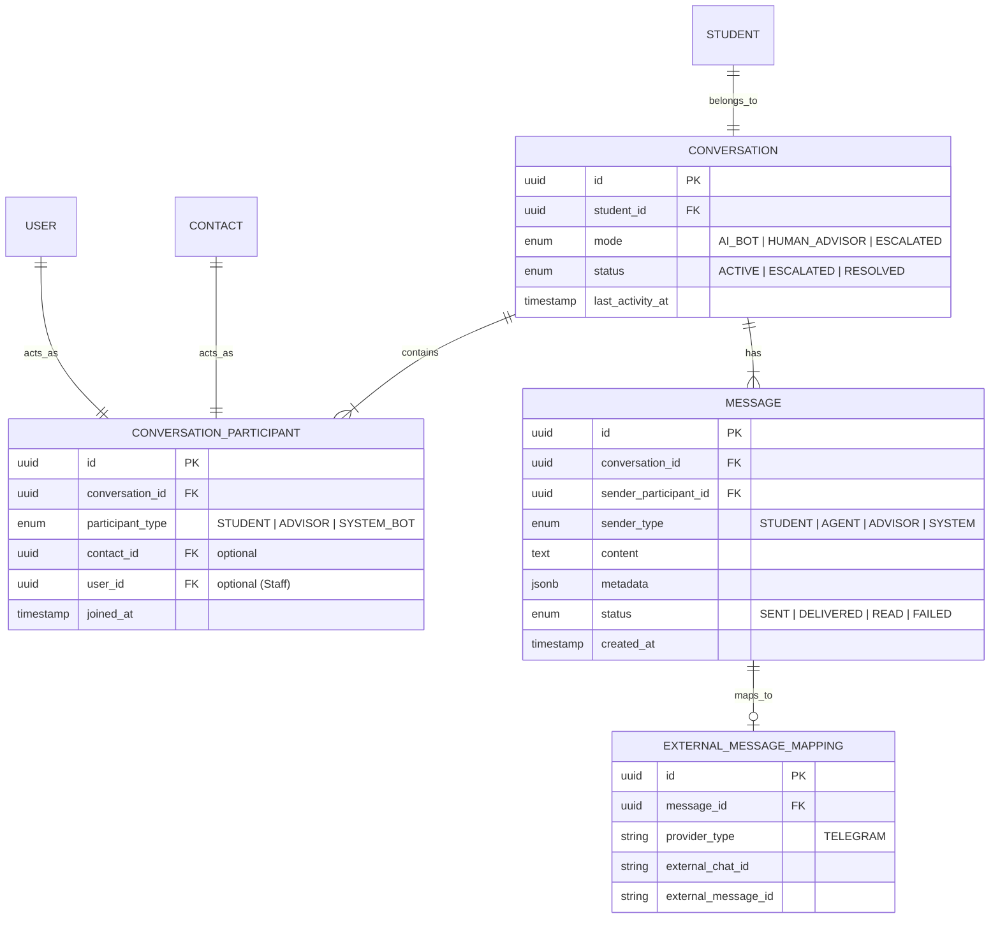

# Telegram Integration Architecture Blueprint

## Overview

This document outlines the architecture for integrating Telegram into the existing modular Node.js/TypeScript backend (`School Finder AI`).

The core architectural requirement is **strict provider isolation**: Telegram functions solely as an inbound/outbound communication adapter. Business domain logic (Conversations, Contacts, Students, Recommendations, AI) remains entirely provider-agnostic. Real-time updates to the React Admin Dashboard are handled via **Centrifugo** using HMAC token authentication and HTTP API broadcasting.

---

## 1. Required Dependencies & Installation

### Package Requirements

| Category | Package Name | Purpose |
| :--- | :--- | :--- |
| **Telegram Framework** | `grammy` | Lightweight, type-safe Telegram Bot API framework for handling webhooks, commands, callback queries, and inline keyboards. |
| **Queue & Background Jobs** | `bullmq`, `ioredis` | Redis-backed queue system for handling asynchronous inbound Telegram update processing and outbound message delivery with rate-limiting retries. |
| **Real-time Integration** | `jsonwebtoken` | Minting HMAC SHA-256 JWT tokens for Centrifugo client connection and channel subscription authorization. |
| **HTTP Client** | `axios` (or native `fetch`) | Executing HTTP API calls to Centrifugo's `/api/publish` endpoint from backend services. |
| **Validation & Security** | `zod` | Validating webhook headers, query parameters, payloads, and environmental variables (already installed). |
| **Logging** | `pino`, `pino-http` | Structured JSON logging with request tracing (already installed). |

### Installation Command

Run the following command in your project root (`C:\Users\USER\Desktop\Picnic\Agents\lanr-agent-backend`):

```bash
npm install grammy bullmq ioredis axios
```

---

## 2. Config & Setup Updates

### Environment Variables Extension (`src/config/env.ts`)

Add the following environment variables to `src/config/env.ts` validated via `zod`:

```ts
// Add to Env Schema in src/config/env.ts
TELEGRAM_BOT_TOKEN: zod.string().min(1),
TELEGRAM_WEBHOOK_SECRET: zod.string().min(16),
TELEGRAM_WEBHOOK_URL: zod.string().url(),

CENTRIFUGO_API_URL: zod.string().url(), // e.g. http://localhost:8000/api
CENTRIFUGO_API_KEY: zod.string().min(1),
CENTRIFUGO_HMAC_SECRET: zod.string().min(16),

REDIS_URL: zod.string().url(), // e.g. redis://localhost:6379
```

---

## 3. Modular Folder Structure

The Telegram integration lives in `src/integrations/telegram`, while Centrifugo client logic resides in `src/integrations/centrifugo`.

```
src/
├── config/
│   ├── env.ts                       # Extended with TELEGRAM_* and CENTRIFUGO_* vars
│   └── centrifugo.config.ts         # Centrifugo secret keys and channel configuration
├── integrations/
│   ├── centrifugo/
│   │   ├── centrifugo.client.ts     # HTTP API client to publish events to Centrifugo
│   │   ├── centrifugo-token.service.ts # Generates JWT connection/subscription tokens for frontend
│   │   └── types/
│   │       └── centrifugo.types.ts  # Types for Centrifugo broadcast payloads
│   └── telegram/
│       ├── controllers/
│       │   └── telegram-webhook.controller.ts
│       ├── routes/
│       │   └── telegram.routes.ts
│       ├── middlewares/
│       │   ├── telegram-secret-verify.middleware.ts
│       │   └── telegram-rate-limit.middleware.ts
│       ├── services/
│       │   ├── telegram-bot.service.ts
│       │   ├── telegram-inbound.service.ts
│       │   └── telegram-outbound.service.ts
│       ├── handlers/
│       │   ├── command.handler.ts
│       │   ├── callback-query.handler.ts
│       │   └── message.handler.ts
│       ├── mappers/
│       │   ├── telegram-user.mapper.ts
│       │   └── telegram-message.mapper.ts
│       ├── schemas/
│       │   └── telegram-webhook.schema.ts
│       └── types/
│           └── telegram.types.ts
```

### Folder Responsibilities & Constraints

#### `integrations/centrifugo/`
* **Purpose**: Encapsulate Centrifugo real-time transport mechanism.
* **Responsibility**:
  * `centrifugo.client.ts`: Send HTTP POST requests to Centrifugo `/api/publish` or `/api/broadcast` endpoints to deliver real-time updates.
  * `centrifugo-token.service.ts`: Mint signed JWT connection tokens (`sub`, `exp`) and channel subscription tokens (`channel`, `exp`) for authorized Advisors/Admins.
* **Dependencies**: `jsonwebtoken`, `axios`/`fetch`, `env.ts`.
* **Prohibited**: Direct Telegram or database logic.

#### `integrations/telegram/controllers/`
* **Purpose**: Entry point for HTTP POST requests sent by Telegram Webhooks.
* **Responsibility**: Parse incoming request, delegate fast acknowledgement (`200 OK`), and hand payload off to BullMQ.
* **Dependencies**: Express `Request`/`Response`, Zod schemas, `telegram-inbound.service`.
* **Prohibited**: Database operations, direct AI invocation, Centrifugo token generation, direct Telegram API calls.

#### `integrations/telegram/services/`
* **Purpose**: Orchestrate Telegram Bot interaction and inbound update workflows.
* **Responsibility**:
  * `telegram-bot.service`: Wrapper around `grammy` Bot client instance.
  * `telegram-inbound.service`: Deduplicates updates, resolves contact identities, delegates to `ConversationModule`, and invokes `CentrifugoClient` to broadcast live message events.
  * `telegram-outbound.service`: Formats and delivers outbound Telegram messages (MarkdownV2, Inline Keyboards).
* **Dependencies**: `grammy`, BullMQ producers, Contact/Conversation domain interfaces, `CentrifugoClient`.
* **Prohibited**: Stateful in-memory session storage, raw SQL execution.

#### `integrations/telegram/handlers/` & `mappers/`
* **Purpose**: Telegram payload handling strategy and data transformation boundary.
* **Responsibility**: Map raw Telegram JSON (`Update`, `Message`, `User`) to clean domain DTOs (`InboundMessageDTO`) and handle Bot commands (`/start`, `/link`).
* **Dependencies**: Domain DTO interfaces, Telegram Bot API types.
* **Prohibited**: Side effects, direct network requests, DB modifications.

---

## 4. Text Processing & Formatting Logic

Telegram's Bot API requires specific escaping rules and text formatting strategies to prevent parsing errors and format outbound messages properly.

### 1. Telegram MarkdownV2 Escaping Engine
Telegram's `MarkdownV2` mode requires reserved special characters to be escaped with a preceding backslash (`\`) whenever text is rendered outside of explicit code blocks.

#### Reserved Special Characters
```
_ * [ ] ( ) ~ ` > # + - = | { } . !
```

#### Escaping Logic Design (`telegram-formatting.util.ts`)
```ts
/**
 * Escapes plain text content to safely inject into Telegram MarkdownV2 messages.
 */
export function escapeMarkdownV2(text: string): string {
  return text.replace(/[_*[\]()~`>#+\-=|{}.!]/g, '\\$&');
}

/**
 * Converts domain message HTML/Plain text formatting into Telegram MarkdownV2.
 */
export function formatOutboundMessage(content: string): string {
  // 1. Sanitize or parse domain formatting
  // 2. Escape reserved MarkdownV2 characters
  // 3. Apply standard formatting wrappers (e.g. *bold*, _italic_)
  return escapeMarkdownV2(content);
}
```

### 2. Long Message Chunking Strategy
Telegram enforces a strict limit of **4,096 characters per message**. Long AI response summaries or advisor recommendations must be chunked safely without breaking Markdown formatting or splitting words across messages.

#### Chunking Algorithm
1. **Length Check**: If `content.length <= 4000`, send as a single message.
2. **Boundary Splitting**: If `content.length > 4000`, split the text along paragraph boundaries (`\n\n`), line breaks (`\n`), or space characters (` `).
3. **Chunk Construction**: Accumulate lines into chunks up to 3,900 characters (leaving safety margin for markdown tags).
4. **Sequence Sending**: Enqueue chunks sequentially into the outbound BullMQ queue to ensure ordered delivery to Telegram.

---

## 5. Architecture & Lifecycles

### Sequence Diagram: Inbound Telegram Message Lifecycle with Centrifugo



### Centrifugo Real-time Integration Flow

1. **Client Connection Authentication**:
   * Frontend requests connection token from backend (`GET /api/v1/auth/centrifugo-token`).
   * Backend signs JWT using `CENTRIFUGO_HMAC_SECRET` containing the user's ID (`sub`).
   * React frontend connects to Centrifugo WebSocket URL using this JWT token.

2. **Channel Subscription Model**:
   * **Global Channel** (`admin:dashboard`): Broadcasts high-level dashboard metrics (e.g., total active leads, new unassigned conversations).
   * **Advisor Channel** (`advisors#<advisorId>`): Private channel for assigned advisors to receive personal alerts, urgent follow-up reminders, and assignment updates.
   * **Conversation Thread Channel** (`conversations#<conversationId>`): Dedicated channel for live message streaming within a specific conversation window.

3. **Message Lifecycles**:
   * **Inbound Message**: Worker persists message to DB → Backend calls `CentrifugoClient.publish("conversations#<id>", messagePayload)` → Centrifugo pushes update down open WebSockets to React UI.
   * **Outbound Advisor Reply**: Advisor sends message from React UI → Backend persists message → Backend pushes event to Centrifugo (optimistic UI sync) → Backend enqueues job to BullMQ `outbound-telegram-queue` for Telegram delivery.

4. **Error Handling & Resilience**:
   * **Centrifugo Outage**: If publishing to Centrifugo fails (e.g., Centrifugo server offline or HTTP timeout), the failure is logged, but database transaction and message persistence succeed. Real-time broadcast is non-blocking to primary business transactions.
   * **Telegram Rate Limits & Network Errors**: Retried via BullMQ exponential backoff strategy based on Telegram HTTP 429 `retry_after` parameters.

---

## 6. Module Responsibilities

| Module | Core Responsibility | Why It Belongs Here |
| :--- | :--- | :--- |
| **Telegram Module** | Provider adapter. Handles Webhook security, maps Telegram updates to DTOs, formats MarkdownV2, and executes outbound Telegram API calls (`sendMessage`, `editMessageText`). | Keeps Telegram-specific formatting, button mechanics, and webhook endpoints isolated from the core CRM. |
| **Centrifugo Integration** | Real-time transport adapter. Generates JWT connection/subscription tokens for frontend clients and publishes server-side event payloads via Centrifugo HTTP API. | Isolates real-time delivery mechanisms so backend services publish events through a clean interface without worrying about WebSocket socket states. |
| **Conversation Module** | Channel-agnostic messaging domain. Manages conversation state (`ACTIVE`, `ESCALATED`, `RESOLVED`), modes (`AI_BOT`, `HUMAN_ADVISOR`), messages, participants, and read statuses. | Provides consistent messaging rules regardless of whether the message originated from Telegram, WhatsApp, or Web Chat. |
| **Contact Module** | Multi-channel identity mapping. Maps provider accounts (`provider_type: TELEGRAM`, `provider_user_id`) to unified CRM Contact profiles. | Enables a single student identity to link across multiple messaging channels over time. |
| **Student Module** | Core education CRM domain logic. Manages student academic profiles, applications, intake status, and advisor assignment rules. | Business and workflow rules remain completely independent of communication providers. |
| **AI Module** | Intelligence provider. Handles preference extraction, conversation summarization, and automated bot responses. | Decoupled AI processing allowing background extraction without blocking messaging queues. |
| **Notification Module**| Alert orchestration. Triggers staff notifications (enqueuing Centrifugo alerts, email follow-ups, or system logs). | Centralized alert management across real-time sockets and offline channels. |

---

## 7. Telegram Design

### 1. Private Chats vs. Group Chats
* **Private Chats**: 1:1 mapping with primary Student Contact. Enables AI bot interaction and human advisor engagement.
* **Group Chats**: Mapped to a single `Conversation` record with `is_group = true`. Individual messages reference the specific `Contact` via `sender_id`. Used for student-family-advisor consultations.

### 2. Commands & Inline Keyboards
* **Bot Commands (`/start`, `/link`, `/help`)**: Processed by `command.handler.ts`. `/start` handles deep-linking query tokens (`/start link_token_xyz`).
* **Inline Keyboards & Callback Queries**: Used for structured option selection (e.g., study level, target country). Button clicks trigger `callback_query.handler.ts` with structured payloads (`ACTION:DATA`).

### 3. Account Linking Workflow
1. Staff or system generates a short-lived token (`LINK-XXXXXX`).
2. Student opens link `https://t.me/SchoolFinderBot?start=link_token_xyz`.
3. `command.handler` intercepts token, validates it via `ContactModule`, and binds `telegram_user_id` to the student's profile.

### 4. Message Persistence & External Mapping
* Internal message details are saved in `conversation_messages`.
* Telegram message IDs are linked in `external_message_mappings` (`message_id`, `provider_type`, `external_chat_id`, `external_message_id`) to support subsequent edits or status updates.

---

## 8. Contact & Student Flow

### Progression & Handoff Pipeline

```
Telegram User ──(First Message /start)──> Contact ──(Bot/AI Qualification)──> Qualified Lead ──(Student Profile Created)──> Student (STU-XXXX) ──(Auto-Assignment)──> Assigned Advisor
```

### Detailed Lifecycle & Onboarding Stages

1. **Lead Capture & Contact Creation (`StudentStatus: NEW`)**:
   * *Trigger*: First webhook update received from a new `telegram_user_id` (e.g. user sends `/start`).
   * *Action*: System creates a `Contact` record (`first_name`, `username`, `provider: TELEGRAM`) and linked `Student` entity (`STU-1048`) with initial status `NEW`.

2. **Bot-Guided Command Onboarding & Preference Collection**:
   * *Trigger*: Bot responds with quick inline keyboard options or commands.
   * *Data Collected*:
     * **Target Destinations**: Canada, United Kingdom, USA, etc.
     * **Program & Study Level**: Masters in Business Analytics, Undergraduate, etc.
     * **Budget & Target Intake**: Fall 2026, $18k - $24k USD per year.
     * **Relocation & Visa Priority**: High, Moderate.
     * **Academic Background & English Test**: BSc Accounting (UNILAG), IELTS (Overall 7.0).

3. **AI Qualification & Conversation Mode (`mode: AI_BOT`)**:
   * *Trigger*: Student chats naturally with the AI bot.
   * *Action*: AI background worker extracts unstructured preferences and populates student criteria. Once minimum threshold is met, status advances to `AWAITING_ASSIGNMENT`.

4. **Automated Advisor Assignment & Real-Time Handoff (`StudentStatus: ASSIGNED`)**:
   * *Automated Assignment Engine*:
     1. **Filter Specializations**: The system checks the student's primary target destination (e.g. `Canada`) and finds all active Advisors specializing in that country.
     2. **Workload & Capacity Check**: Evaluates each specialized advisor's active non-closed student workload (`active_student_count`) and filters for available advisors (`AdvisorAvailability: AVAILABLE`).
     3. **Weighted Round-Robin Assignment**: Selects the available advisor with the lowest current workload (e.g. *Amina Yusuf*).
     4. **Atomicity**: The transaction atomically updates `Student.assignedAdvisorId`, updates status to `ASSIGNED`, and appends an immutable assignment history record.
   * *Admin / Operations Override*: Admins and authorized Operations staff can reassign advisors manually at any time if workload adjustments are needed.
   * *Real-time Events*: Centrifugo publishes an assignment alert to `advisors#<advisor_id>` to grant the assigned advisor real-time access to the conversation thread (`conversations#<conversation_id>`), while updating the global `admin:dashboard` metrics.
   * *Handoff*: `Conversation.mode` switches from `AI_BOT` to `HUMAN_ADVISOR`, suppressing automated AI responses so the assigned advisor can communicate directly.

5. **Escalation & Resolution**:
   * *Trigger*: Advisor flags an issue or student requests supervisor review (`mode: ESCALATED`).
   * *Action*: Real-time alerts sent to Operations/Admin. Once resolved, status returns to `ACTIVE`/`RESOLVED`.

---

## 9. Conversation Architecture


